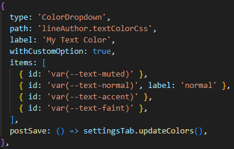
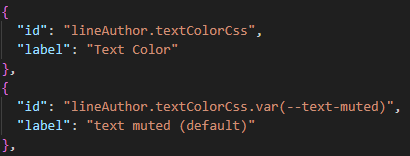
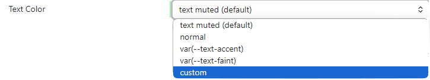
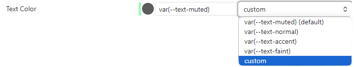

# `ColorDropdown`
The `ColorDropdown` component provides a versatile UI element that combines a color picker, an input field, and a dropdown menu, allowing users to select or input a color value in various formats.

## Usage & Configuration

The following example demonstrates how to configure the `ColorDropdown` component, especially in combination with localization. This showcases how localization can override configuration properties.

In practice, you can either:

* Use configuration alone (if localization is not required), or
* Delegate all language-specific aspects (like labels) to the localization file, keeping the configuration purely structural.

### Label Overriding

In the example below:

* The configuration specifies a label: `'My Text Color'`.
* The localization file contains an entry for the same `id: 'lineAuthor.textColorCss'` with a label: `'Text Color'`.

> **Result:** The label from the localization file (`'Text Color'`) overrides the one from the configuration.

Additionally, the localization file includes an entry for a specific dropdown item: 
`id: 'lineAuthor.textColorCss.var(--text-muted)'`. 
This overrides the label for that individual dropdown item only.

Other dropdown items—such as `var(--text-accent)` and `var(--text-faint)`—do not have localized labels, so their `id` values are used as fallback labels.

### 📄 Configuration Entry (`setting-config.ts`)

### 🌐 Localization Entry (`setting-en.json`)

This overrides both the dropdown's main label and one of its item labels.

### 🧩 Rendered Element in Settings Panel

The basic form of the `ColorDropdown`:

When the user selects the **Custom** option, the component expands to include a color picker and an input field:

This allows users to enter a color value manually or pick one using the visual selector.
## Parameters 
<table><tr><th>Name</th><th>Type</th><th>Description</th></tr>
<tr><td><code>type</code></td><td><code>'ColorDropdown'</code></td><td></td></tr>
<tr><td><code>datatype?</code></td><td><code>'RGB' | 'string' | 'Hex'</code></td><td>⭐ 'Hex' is default</td></tr>
<tr><td><code>withCustomOption?</code></td><td><code>boolean</code></td><td>Adds additional 'custom' option at the end of the list, 
which, if selected, display addition colorpicker and an inputfield. 
The user can then use those to set the color.</td></tr>
<tr><td><code>items</code></td><td><code><a href='DropdownItem.md'>DropdownItem</a>[]</code></td><td></td></tr>
<tr><td colspan='3'><b><em>Common for all elements</em></b></td></tr>
<tr><td colspan='3'><b><em>Variante (a):</em></b></td></tr>
<tr><td><code>path</code></td><td><code>string</code></td><td>The name (path) of the element in the settings structure</td></tr>
<tr><td colspan='3'><b><em>Variante (b):</em></b></td></tr>
<tr><td><code>handler</code></td><td><code><a href='SettingHandler.md'>SettingHandler</a></code></td><td>Used if the values are not stored in the settings</td></tr>
<tr><td><code>id? | id</code></td><td><code>string</code></td><td>Mandatory if localization is used</td></tr>
<tr><td colspan='3'><b><em>Common in both variants</em></b></td></tr>
<tr><td><code>placeholder?</code></td><td><code>string | number</code></td><td></td></tr>
<tr><td><code>preSave?</code></td><td><code>(value: any) =&gt; void | Promise&lt;void&gt;</code></td><td>This function is called before the value is saved to the settings.</td></tr>
<tr><td><code>postSave?</code></td><td><code>() =&gt; void | Promise&lt;void&gt;</code></td><td>This function is called after the value is saved to the settings.</td></tr>
<tr><td><code>label? | label</code></td><td><code>string</code></td><td>The label displayed for the element.</td></tr>
<tr><td><code>hint?</code></td><td><code>string</code></td><td>The hint displayed under the element.</td></tr>
<tr><td><code>tooltip?</code></td><td><code>string[]</code></td><td>The tooltip text displayed on hover. Supports HTML formatting.</td></tr>
<tr><td><code>replacements?</code></td><td><code>() => <a href='Replacement.md'>Replacement</a>[]</code></td><td>A function returning an array of { name: string, text: string } entries for dynamic placeholder substitution in label, hint, and tooltip values.</td></tr>
<tr><td><code>showIf?</code></td><td><code>boolean</code></td><td>Controls element visibility. If true, the element is shown.</td></tr>
</table>