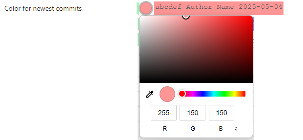

# `ColorPicker`
| Example                       |  |
|

-| 
 | 
|  | display mode |
|  | editing mode |
## Parameters 
<table><tr><th>Name</th><th>Type</th><th>Description</th></tr>
<tr><td><code>type</code></td><td><code>'ColorPicker'</code></td><td></td></tr>
<tr><td><code>datatype?</code></td><td><code>'RGB' | 'string' | 'Hex'</code></td><td></td></tr>
<tr><td><code>preview?</code></td><td><code>() =&gt; string</code></td><td></td></tr>
<tr><td colspan='3'><b><em>Common for all elements</em></b></td></tr>
<tr><td colspan='3'><b><em>Variante (a):</em></b></td></tr>
<tr><td><code>path</code></td><td><code>string</code></td><td>The name (path) of the element in the settings structure</td></tr>
<tr><td colspan='3'><b><em>Variante (b):</em></b></td></tr>
<tr><td><code>handler</code></td><td><code><a href='SettingHandler.md'>SettingHandler</a></code></td><td>Used if the values are not stored in the settings</td></tr>
<tr><td><code>id? | id</code></td><td><code>string</code></td><td>Mandatory if localization is used</td></tr>
<tr><td colspan='3'><b><em>Common in both variants</em></b></td></tr>
<tr><td><code>placeholder?</code></td><td><code>string | number</code></td><td></td></tr>
<tr><td><code>preSave?</code></td><td><code>(value: any) =&gt; void | Promise&lt;void&gt;</code></td><td>This function is called before the value is saved to the settings.</td></tr>
<tr><td><code>postSave?</code></td><td><code>() =&gt; void | Promise&lt;void&gt;</code></td><td>This function is called after the value is saved to the settings.</td></tr>
<tr><td><code>label? | label</code></td><td><code>string</code></td><td>The label displayed for the element.</td></tr>
<tr><td><code>hint?</code></td><td><code>string</code></td><td>The hint displayed under the element.</td></tr>
<tr><td><code>tooltip?</code></td><td><code>string[]</code></td><td>The tooltip text displayed on hover. Supports HTML formatting.</td></tr>
<tr><td><code>replacements?</code></td><td><code>() => <a href='Replacement.md'>Replacement</a>[]</code></td><td>A function returning an array of { name: string, text: string } entries for dynamic placeholder substitution in label, hint, and tooltip values.</td></tr>
<tr><td><code>showIf?</code></td><td><code>boolean</code></td><td>Controls element visibility. If true, the element is shown.</td></tr>
</table>